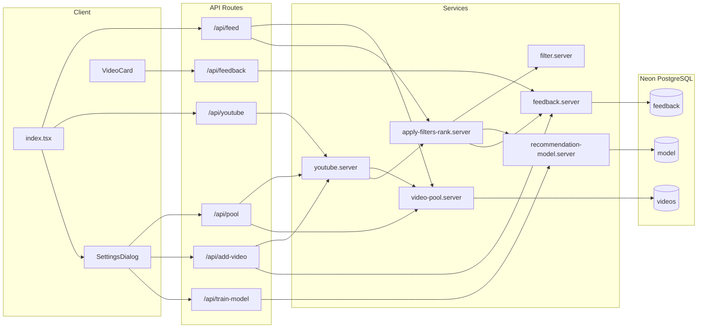

# Crazy Refresh Pull

A personalized YouTube discovery app that surfaces "authentic" long-form videos. You seed a local video pool (from YouTube search or by adding favorites), give like/dislike feedback, optionally train a recommendation model, and get a feed or search results that prefer pool-first (to save API quota) and that are filtered and ranked by custom heuristics and your feedback.

## Tech stack

- **Frontend:** Solid.js, Solid Start (Vinxi), Solid Router, Tailwind CSS, Lucide icons
- **Backend:** Solid Start API routes (server-side)
- **Database:** Neon PostgreSQL via `@netlify/neon` (uses `NETLIFY_DATABASE_URL`)
- **External:** YouTube Data API v3 (user-supplied API key; optional for pool-only usage)

## Architecture and data flow

- **User actions:** Open app, refresh feed, search, like/dislike, add favorite by URL, open Settings (API key, filter settings, seed pool, train model).
- **Feed path:** `GET /api/feed` -> `video-pool.server` `getRandomRecommendations()` -> DB pool -> `apply-filters-rank.server` (exclude feedback, optional custom filter, optional model ranking) -> JSON to client.
- **Search path:** Client calls `GET /api/youtube?q=...` -> `youtube.server` `handleYouTubeSearchRequest` -> if `usePoolFirst`: `video-pool.server` `searchPool()` then `applyFiltersAndRank`; else YouTube API search + details, then same filter/rank; new results are merged into pool via `addToPool`.
- **Feedback:** Like/Dislike/Remove via `POST /api/feedback` -> `feedback.server` and `db-repositories/feedback`; Add favorite via `POST /api/add-video` (YouTube fetch + add positive feedback).
- **Pool seeding:** `POST /api/pool` with `apiKey` + `queries` -> YouTube search per query -> `addToPool` -> DB `videos` (with eviction at MAX_POOL_SIZE).
- **Model:** `POST /api/train-model` -> `recommendation-model.server` trains logistic regression on positive/negative feedback metadata; model stored in DB `model`. Used in `applyFiltersAndRank` and YouTube search path to rank results.

## Key concepts

### Video pool

Local cache of videos (table `videos`). Filled by search results and pool seeding. Evicted by oldest when exceeding `MAX_POOL_SIZE` (3000). Feed and search use pool first when possible to avoid YouTube API cost.

### Feed

Random recommendations from the pool, after excluding already-feedback videos, optional authenticity filtering, and optional model-based ranking.

### Search

Query can be served from pool (`searchByTerms` + filter/rank) or, if no API key or pool miss, from YouTube API; results are merged into pool.

### Feedback

Like / dislike / remove stored in `feedback` with optional metadata (title, description, channel, etc.). Used to exclude from results, to train the recommendation model, and to build keyword/channel patterns for the custom filter.

### Custom filtering

`filter.server` scores videos (clickbait, description quality, engagement, feedback-based keyword/channel match) and keeps videos above `authenticityThreshold` (default 0.4).

### Recommendation model

Logistic regression (10 features) trained on positive/negative feedback; used to score and rank videos in feed and search.

## Project structure

| Directory              | Role                                                                                                                                       |
| ---------------------- | ------------------------------------------------------------------------------------------------------------------------------------------ |
| `src/routes/`          | [index.tsx](src/routes/index.tsx) (home + feed/search UI), [api/](src/routes/api/) (feed, youtube, pool, feedback, add-video, train-model) |
| `src/services/`        | Server-only: db.server (Neon + schema), video-pool, youtube, filter, apply-filters-rank, feedback, recommendation-model                    |
| `src/db-repositories/` | Data access: videos, feedback, model                                                                                                       |
| `src/components/`      | video-card, settings-dialog, ui/                                                                                                           |
| `src/lib/`             | cookie, encryption (API key obfuscation), html-entities, utils                                                                             |

## Environment variables

- **NETLIFY_DATABASE_URL** (required): PostgreSQL connection string for Neon. The app uses `@netlify/neon`, which reads this automatically. Do not commit real values.
- **YOUTUBE_API_KEY** (optional): Can be set server-side for API fallback; typically users provide their own key in Settings (stored client-side in cookie/sessionStorage, sent per request).

## Getting started

**Prerequisites:** Node >= 22 (see [package.json](package.json) engines).

1. **Install:** `npm install`
2. **Database:** Set `NETLIFY_DATABASE_URL` in `.env`. On first run the app creates tables (`feedback`, `videos`, `model`) via [db.server.ts](src/services/db.server.ts) `ensureSchema()`.
3. **Run dev:** `npm run dev`
4. **Build / start:** `npm run build`, `npm run start`

## API reference

| Endpoint           | Method | Purpose                                                                                              |
| ------------------ | ------ | ---------------------------------------------------------------------------------------------------- |
| `/api/feed`        | GET    | Random recommendations from pool (limit, useCustomFiltering, authenticityThreshold, optional apiKey) |
| `/api/youtube`     | GET    | Search: pool-first then YouTube; query params q, apiKey, useCustomFiltering, maxResults, etc.        |
| `/api/pool`        | GET    | Pool status (count, updatedAt)                                                                       |
| `/api/pool`        | POST   | Seed pool (body: apiKey, queries, maxPagesPerQuery)                                                  |
| `/api/feedback`    | GET    | Feedback status for videoId or batch videoIds                                                        |
| `/api/feedback`    | POST   | Like / dislike / remove (body: action, videoId, metadata)                                            |
| `/api/add-video`   | POST   | Add video by URL as positive feedback (body: url, apiKey)                                            |
| `/api/train-model` | GET    | Model status (available, counts, trainedAt)                                                          |
| `/api/train-model` | POST   | Train recommendation model on current feedback                                                       |

## YouTube API quota

Default quota is 10,000 units/day. Each search page costs about 101 units (search.list 100 + videos.list 1). Settings and pool/search limits (`maxPagesToSearch`, `maxTotalVideosToFetch`) are tuned so multiple searches per day stay within quota; adjust in Settings if needed.

## Credits

This project was created with the [Solid CLI](https://github.com/solidjs-community/solid-cli).
