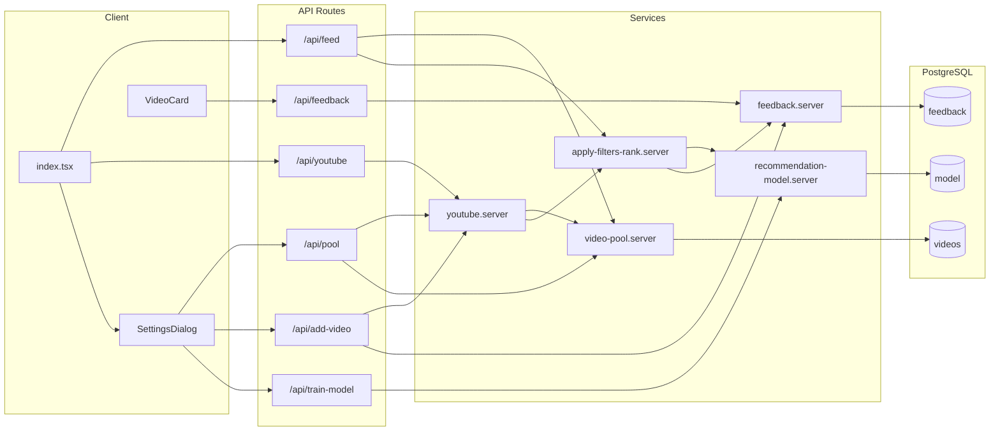

# Crazy Refresh Pull

A personalized YouTube discovery app that surfaces long-form videos. You seed a local video pool (from YouTube search or by adding favorites), give like/dislike feedback, and optionally train a learned recommendation model. The feed and search prefer pool-first (to save API quota) and rank results using the model trained on your feedback.

## Tech stack

- **Frontend:** Solid.js, Solid Start (Vinxi), Solid Router, Tailwind CSS, Lucide icons
- **Backend:** Solid Start API routes (server-side)
- **Database:** PostgreSQL via Prisma ORM (uses `DATABASE_URL`)
- **External:** YouTube Data API v3 (user-supplied API key; optional for pool-only usage)

## Architecture and data flow

- **User actions:** Open app, refresh feed, search, like/dislike, add favorite by URL, open Settings (API key, filter settings, seed pool, train model).
- **Feed path:** `GET /api/feed` -> `video-pool.server` `getRandomRecommendations()` -> DB pool -> `apply-filters-rank.server` (exclude feedback, then rank by learned model when available) -> JSON to client.
- **Search path:** Client calls `GET /api/youtube?q=...` -> `youtube.server` `handleYouTubeSearchRequest` -> if pool has results: `video-pool.server` `searchPool()` then `applyFiltersAndRank`; else YouTube API search + details, then `applyFiltersAndRank`; new API results are merged into pool via `addToPool`.
- **Feedback:** Like/Dislike/Remove via `POST /api/feedback` -> `feedback.server` and `db-repositories/feedback`; Add favorite via `POST /api/add-video` (YouTube fetch + add positive feedback).
- **Pool seeding:** `POST /api/pool` with `apiKey` + `queries` -> YouTube search per query -> `addToPool` -> DB `videos` (with eviction at MAX_POOL_SIZE).
- **Model:** `POST /api/train-model` -> `recommendation-model.server` trains logistic regression on positive/negative feedback; model stored in DB `model`. Used in `applyFiltersAndRank` to rank feed and search results.

## Key concepts

### Video pool

Local cache of videos (table `videos`). Filled by search results and pool seeding. Evicted by oldest when exceeding `MAX_POOL_SIZE` (3000). Feed and search use pool first when possible to avoid YouTube API cost.

### Feed

Random recommendations from the pool. Already-liked/disliked videos are excluded; when the recommendation model is trained, results are ranked by it.

### Search

Query is served from the pool when possible (`searchPool` + `applyFiltersAndRank`); otherwise the app calls the YouTube API (using Settings: max pages, max videos, min duration), then applies the same exclusion and ranking. New API results are merged into the pool.

### Feedback

Like / dislike / remove stored in `feedback` with optional metadata (title, description, channel, etc.). Used to exclude those videos from results and to train the recommendation model (which uses the same metadata for features).

### Recommendation model

Logistic regression (10 hand-crafted features) trained on positive/negative feedback. When trained, it scores and ranks videos in feed and search; no rule-based filtering is applied.

## Project structure

| Directory              | Role                                                                                                                                       |
| ---------------------- | ------------------------------------------------------------------------------------------------------------------------------------------ |
| `src/routes/`          | [index.tsx](src/routes/index.tsx) (home + feed/search UI), [api/](src/routes/api/) (feed, youtube, pool, feedback, add-video, train-model) |
| `src/services/`        | Server-only: db.server (Prisma client), video-pool, youtube, apply-filters-rank, feedback, recommendation-model                              |
| `src/db-repositories/` | Data access: videos, feedback, model                                                                                                       |
| `src/components/`      | video-card, settings-dialog, ui/                                                                                                           |
| `src/lib/`             | cookie, encryption (API key obfuscation), html-entities, utils                                                                             |

## Environment variables

- **DATABASE_URL** (required): PostgreSQL connection string. Used by Prisma ORM for database access. Do not commit real values.
- **YOUTUBE_API_KEY** (optional): Can be set server-side for API fallback; typically users provide their own key in Settings (stored client-side in cookie/sessionStorage, sent per request).

## Getting started

**Prerequisites:** Node >= 22 (see [package.json](package.json) engines).

1. **Install:** `npm install`
2. **Database:** Set `DATABASE_URL` in `.env`. Run `npx prisma db push` to create/sync the database schema, then `npx prisma generate` to generate the Prisma client.
3. **Run dev:** `npm run dev`
4. **Build / start:** `npm run build`, `npm run start`

## API reference

| Endpoint           | Method | Purpose                                                                                              |
| ------------------ | ------ | ---------------------------------------------------------------------------------------------------- |
| `/api/feed`        | GET    | Random recommendations from pool (limit, optional apiKey)                                            |
| `/api/youtube`     | GET    | Search: pool-first then YouTube; query params q, apiKey, maxResults, maxPagesToSearch, maxTotalVideosToFetch, minVideoDurationSeconds, usePoolFirst |
| `/api/pool`        | GET    | Pool status (count, updatedAt)                                                                       |
| `/api/pool`        | POST   | Seed pool (body: apiKey, queries, maxPagesPerQuery)                                                  |
| `/api/feedback`    | GET    | Feedback status for videoId or batch videoIds                                                        |
| `/api/feedback`    | POST   | Like / dislike / remove (body: action, videoId, metadata)                                            |
| `/api/add-video`   | POST   | Add video by URL as positive feedback (body: url, apiKey)                                            |
| `/api/train-model` | GET    | Model status (available, counts, trainedAt)                                                          |
| `/api/train-model` | POST   | Train recommendation model on current feedback                                                       |

## YouTube API quota

Default quota is 10,000 units/day. Each search page costs about 101 units (search.list 100 + videos.list 1). Settings and pool/search limits (`maxPagesToSearch`, `maxTotalVideosToFetch`) are tuned so multiple searches per day stay within quota; adjust in Settings if needed.

## Credits

This project was created with the [Solid CLI](https://github.com/solidjs-community/solid-cli).
